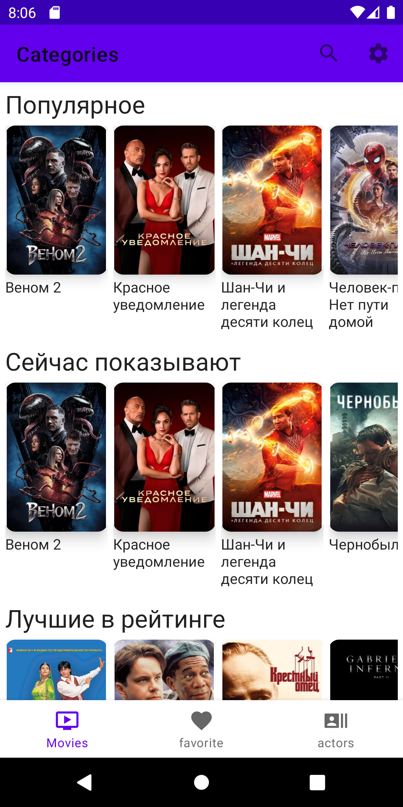

# Movie
### Movie app is based on Kotlin, MVVM architecture, coroutines and dagger.

__________

### Dependencies
- [Google-Material](https://github.com/material-components/material-components-android) - material Components for Android (MDC-Android) help developers execute Material Design.
- [Glide](https://github.com/bumptech/glide) - loading image.
- [Retrofit2](https://github.com/square/retrofit) - constructing the REST API.
- [Gson converter](https://github.com/square/retrofit/tree/master/retrofit-converters/gson) - a converter which uses Gson for serialization to and from JSON
- [Logging Interceptor](https://github.com/square/okhttp/tree/master/okhttp-logging-interceptor) - logs HTTP request and response data.
- [Coroutines](https://github.com/Kotlin/kotlinx.coroutines) - kotlin side(at the language level) supports for asynchronous programming.
- [Mvvm module](/mvvm) is the implementation of user interfaces on the application. 
- [Dagger2](https://github.com/google/dagger) - constructing dependency injection framework based on compile-time. 
- [SwipeRefreshLayout] - refresh screens

### Project screen
 
 
 

